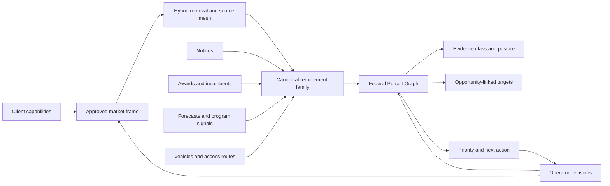

<div align="center">

# LILA

### The federal market, reconstructed around how you win

See demand earlier. Understand the market around it. Know which paths are real. Act with evidence.

**LILA transforms fragmented federal market data into a living, client-specific model of demand, competition, access, timing, and people.**

</div>

---

## Opportunity data is only the visible edge of the federal market

No single federal system contains the market. A posted notice can show what an agency is buying now, but not the full budget pressure behind it, the acquisition forecast that preceded it, the incumbent position it may disrupt, the vehicle that controls access, the policy change shaping demand, or the people connected to the decision.

LILA is built to assemble those signals. Its governed source catalog currently defines **74 source identities across 36 evidence families**, selected according to the client and the declared engagement scope.

| Market question | Evidence LILA |
|---|---|
| **What is buying now?** | SAM.gov opportunities and notice documents, agency announcements, grants, SBIR and STTR topics, research and program-funding opportunities |
| **What is likely to buy next?** | Agency acquisition forecasts from DHS, GSA, Army, NASA, HHS, State, Education, HUD, SEC, Navy, VA, EPA, Treasury, and DOJ |
| **Where is the money moving?** | USAspending awards and subawards, FPDS contract actions, DoD award announcements, NIH RePORTER, Treasury Fiscal Data, OMB budgets, apportionments and SF-133 execution reports, appropriations evidence, and defense budget exhibits |
| **Who already has position?** | Incumbent awards, subcontracting relationships, GSA eLibrary, OASIS+, NITAAC, NASA SEWP, DoD ESI catalogs, SBA vendor and mentor-protege data, FedRAMP, company filings, and vendor announcements |
| **What determines access and risk?** | Vehicle eligibility, AbilityOne, SAM.gov entity and exclusion records, acquisition regulations, wage determinations, GAO and CBCA decisions, Court of Federal Claims dockets, Inspector General findings, and procurement scorecards |
| **What is changing the market?** | Federal Register and Regulations.gov activity, RegInfo agendas, Congress.gov and GovInfo, GAO and Oversight.gov reports, CISA vulnerabilities, agency hierarchy, public research, and federal and trade news |

The source count is not the product. The intelligence created between the sources is.

LILA resolves identities across records, reconstructs requirement families, distinguishes a live solicitation from a forecast or market signal, traces spending to buyers and incumbents, tests the client’s acquisition route, connects qualified opportunities to the right organizations and people, and preserves the evidence behind every conclusion. Conflicting records remain visible. Missing or blocked sources are named. Every sweep records what it attempted, what it found, and where its coverage ends.

The result is more than search. It is an evidence-backed operating picture of where demand is forming, how the client can reach it, what deserves attention now, and what must happen next. Each reviewed decision improves the vocabulary, relationships, exclusions, and ranking evidence available to the next pursuit.

## Retrieval that learns the buyer’s language

Federal demand rarely arrives in the language a company uses to describe itself. A buyer may describe a product category as a mission problem, bury the requirement in an attachment, or use terminology learned from an incumbent. One of LILA’s hardest retrieval problems is finding that relevant demand without flooding the user with records that merely share a word.

LILA begins with an operator-approved client frame: products, services, capability statements, buyer language, named market entities, NAICS boundaries, and exclusions. It then widens that frame in controlled ways.

1. **Measure the vocabulary.** The system scans the durable federal notice corpus to find noun phrases that occur disproportionately inside the client’s relevant market. Candidates are ranked by lift, not raw frequency, so federal boilerplate does not masquerade as insight.
2. **Propose, never silently apply.** Discovered terms return with real yield counts and sample titles. An operator decides which language belongs in the client frame.
3. **Retrieve lexically and semantically.** An FTS5 index supplies BM25-ranked lexical candidates. A local `BAAI/bge-base-en-v1.5` embedding sidecar supplies semantic candidates. Reciprocal rank fusion combines the two without forcing incomparable scores onto one scale.
4. **Keep the guards armed.** Ambiguous entities, common words, witnessed negative contexts, and out-of-domain uses still pass through the same guard ladder. A semantic score can nominate a candidate; it cannot declare the candidate relevant.
5. **Receipt the result.** Every retrieval run records what each lane returned, what the guards rejected, what was deduplicated, which source boundaries applied, and which matched sentence supports the surviving record.

That combination matters. Pure keyword search misses the buyer’s language. Pure semantic search can produce persuasive noise. LILA uses both, then makes every surviving path explain itself.

The system also re-screens the full accumulated notice store and stored forecast sources against approved client frames. This recovers signals that disappeared from a daily feed, arrived before the client was onboarded, or used terminology the system learned later.

## One intelligence loop, four compounding advantages

| Loop | What LILA does | What improves over time |
|---|---|---|
| **Surface** | Searches live notices, historical awards, forecasts, program signals, official publications, and bounded market sources | Client vocabulary, source coverage, retrieval features, and exclusion rules |
| **Understand** | Resolves identities, requirement families, evidence class, market role, access route, timing, and provenance | The system stops reconstructing the same relationships report by report |
| **Prioritize** | Separates live pursuits from forecasts and history, tests route eligibility, deduplicates solicitation families, and ranks evidence-backed actions | Operator decisions become structured posture, route, and relevance knowledge |
| **Act** | Produces opportunity boards, market maps, target groups, source receipts, and release-gated client artifacts | Each qualified opportunity carries the people, organizations, and next motion needed to work it |

The goal is not to make a model sound certain. The goal is to make the market more legible with every reviewed record.

## Prioritization is a chain of proof

Most market-intelligence products collapse discovery, relevance, and commercial advice into one opaque score. LILA keeps them separate.

Every relevant record is classified along independent dimensions:

- **Evidence class:** client history, competitive history, current opportunity, forecast, event, excluded, or ambiguous.
- **Commercial route:** direct, incumbent, named-partner teaming, possible subcontracting, or unknown.
- **Window state:** live, fiscal-year only, unstated, or stated past.
- **Service fit:** direct, adjacent, unrelated, or ambiguous.
- **Provenance:** measured, cited, or inferred, with inferred decisions capped below high confidence.

Those distinctions prevent common and expensive errors. A partner holding contract paper does not automatically become a competitor. A past forecast does not become a current opportunity. A restricted set-aside does not rank as a direct pursuit without an eligible route. A client alias cannot survive as a rival. A target cannot survive after the opportunity that justified it is removed.

Prioritization then combines the record’s retrieval evidence with its requirement family, buyer, response window, incumbent context, demonstrated prime posture, vehicle path, and operator disposition. Current rules remain deterministic and auditable. Feature rows are preserved so learned ranking can be promoted only after it beats the standing system on real client data.

This produces a decision hierarchy, not a generic list:

- **Pursue:** live, supported, accessible work that deserves action now.
- **Qualify:** promising evidence that still needs a named uncertainty resolved.
- **Shape or watch:** forecast, recompete, policy, budget, or program movement that can create a future opening but does not establish a live solicitation.
- **Pass:** out-of-scope, inaccessible, stale, duplicative, or weakly supported records retained in the audit trail rather than padded into the client view.

## The Federal Pursuit Graph

LILA’s operating model is the **Federal Pursuit Graph**: governed relationships over durable stores and ledgers, exposed through a shared interface rather than forced into one monolithic database.

The graph core binds canonical client and company identities, canonical requirement families, evidence class, commercial route, window state, opportunity-linked targets, and provenance. It extends outward to notices, awards, forecasts, buyers, incumbents, vehicles, official contacts, enrichment candidates, and operator decisions.



The graph is not a decorative visualization. It is an integrity boundary. Before a client-facing view is assembled, deterministic certification checks for broken relationships such as self-competition, partner and competitor conflation, past windows promoted as current, direct routes without eligibility, duplicate requirement families, and targets orphaned from qualified opportunities.

The implementation deliberately preserves the systems that already own their truth. The notice store remains the notice store. Assess ledgers remain the release-grade source for live solicitation decisions. The contact graph remains an append-only record of official observations. Approved target enrichments remain separate from published contacts. The graph adapter makes those systems reusable across reports while keeping their provenance and operator gates intact.

An incremental cache tracks classification decisions, normalized entities, source extracts, resolved URLs, marks, embeddings, and approved enrichments. A changed source record invalidates the relationships that depend on it. An unchanged record can be reused. Removing a requirement edge prunes only the targets that no longer have support. Every press can emit a compact graph receipt instead of asking the next agent to reconstruct market state from a large rendered report.

## Learning without surrendering control

LILA treats operator judgment as first-class data.

Approved vocabulary, aliases, named competitors, partner routes, exclusions, requirement decisions, title sets, target approvals, and release decisions are all explicit artifacts. They are bound to the exact client, scope, evidence, and version that produced them. If the evidence changes, the prior approval becomes stale instead of drifting forward invisibly.

The current learning loop improves the system through four safe surfaces:

- **Vocabulary learning:** corpus-derived terms are proposed with measured yield and accepted by an operator.
- **Classification learning:** witnessed failure cases become shared rules, fixtures, and negative-context evidence rather than one-off report edits.
- **Relationship learning:** resolved identities, requirement families, routes, and provenance can be reused across future presses.
- **Ranking learning:** every candidate retains inspectable retrieval and classification features, creating a clean path to model promotion after real-data evaluation.

**LILA Swipe** is the experimental review surface for this same intelligence, not a separate evidence system. It is being built to let an operator move quickly through evidence-bound opportunity cards and turn keep, pass, and reason judgments into structured feedback. The interaction never replaces source proof, graph certification, or release gates; it supplies reviewed labels that can improve client-specific retrieval and ranking once real-data promotion criteria are met.

## Evidence before eloquence

LILA uses models where interpretation helps and deterministic code where the answer must be checkable.

- Source identity, entity resolution, date state, deduplication, set-aside access, arithmetic, count semantics, relationship integrity, and release eligibility are code-owned.
- Every displayed figure carries source system, record identity, source URL, and retrieval time in its internal provenance.
- Primary federal records win figure disputes. Conflicting primary records freeze the figure for human resolution. A model never settles a dispute over a number it authored.
- Forecasts and award expirations can shape a pursuit thesis, but only live notice evidence can establish a posted opportunity.
- Source coverage is visible. A bounded pull is labeled bounded. A failed or blocked source is named. “Comprehensive” refers to the declared collection contract, never the entire internet or every restricted procurement system.
- Client release fails closed. Human approval, declared source coverage or explicit acceptance of the exact blocker rows, evidence binding, open flags, report validation, and an explicit release action must agree.

The result is a system that can be imaginative about where to look while remaining conservative about what it claims.

## What LILA produces

### Federal Opportunity Pre-Assessment

A release-gated signal board for what is live now: qualified solicitation families, fit evidence, deadlines, route decisions, source coverage, and the exact records behind the board.

### Federal Market Map

An evidence-dense view of the client’s federal market: priority opportunities, buyer spending, competitive positions, teaming routes, forecasts, events, account decisions, and opportunity-specific targets. Numbers reconcile to their source records, and displayed relationships come from the same governed intelligence layer.

### Targeting and contact intelligence

Deterministic target specifications are derived from the opportunity and route. Published federal contacts remain visibly distinct from operator-approved or Apollo-enriched people. No live enrichment call occurs during a report press, and no missing person is replaced with a generic contact.

### Internal change intelligence

Recurring digests compare the current governed market state with the last observed state: entries, exits, forecast movement, recompete changes, and evidence drift. Movement is planning intelligence, not proof that a solicitation exists.

## Proof has levels

LILA keeps fixture proof, real-data proof, and release proof separate.

1. **Fixture proof** demonstrates that a rule handles known failure classes and preserves invariants.
2. **Real-data proof** measures retrieval, classification, and relationship behavior against actual client frames and stored federal records.
3. **Release proof** binds the exact evidence, operator approvals, rendered artifact, validation receipt, and release action.

A green unit test does not become a market claim. A good-looking fixture does not become real-data proof. A clean rendered report does not become releasable without the evidence-bound human gate. This separation is one of LILA’s most important product features.

## Repository map

| Area | Responsibility |
|---|---|
| [`agents/assess/`](agents/assess/) | Immutable live, horizon, and partner ledgers; pursuit grading; approval-bound report truth |
| [`agents/golden_press/`](agents/golden_press/) | Retrieval guards, evidence packs, decision rules, market maps, targeting, deterministic validation, and press orchestration |
| [`tools/api/`](tools/api/) | Cataloged source adapters, official data collection, bounded coverage, and provenance |
| [`tools/contact_graph/`](tools/contact_graph/) | Shared official-contact observations, identity resolution, grading, querying, and outreach state |
| `tools/retrieval/` | FTS5/BM25, local dense retrieval, reciprocal rank fusion, measurement, and gated experiments |
| `tools/intelligence_graph/` | Shared graph interface, incremental cache, workflow contract, and compatibility adapters |
| [`ui/`](ui/) | The local Command Center for scope, review, press, release, and Target gates |
| [`tests/`](tests/) | Offline contract, property, regression, leakage, rendering, and interaction proof |

## Run the Command Center

```bash
python3 -m venv .venv
.venv/bin/pip install -r requirements.txt
python3 run_ui.py
```

Open `http://127.0.0.1:8321`. Report builds run through the Command Center so scope, evidence, approvals, validation, and release state remain bound to the same operation.

Run the offline suite with:

```bash
.venv/bin/python -m pytest tests/ -q
```

## The direction

The federal market is already a graph. Requirements become forecasts, forecasts become notices, notices become awards, awards expose incumbents and vehicles, vehicles reveal routes, and routes define the people a seller needs to reach. Most tools flatten that graph into search results and force the user to rebuild the relationships by hand.

LILA preserves those relationships as working intelligence. Each source pull can improve the market map. Each reviewed decision can improve the next search. Each qualified opportunity can carry its route, evidence, targets, and next action forward. The system becomes more useful not because it produces more text, but because it forgets less of what the team has already learned.
